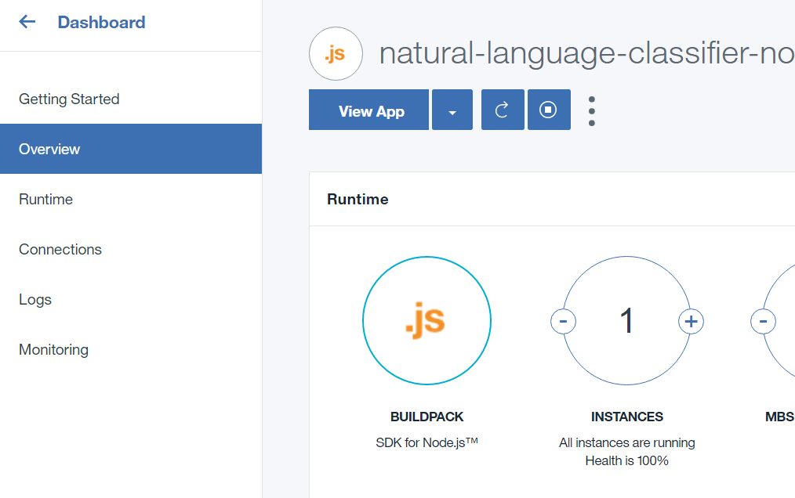
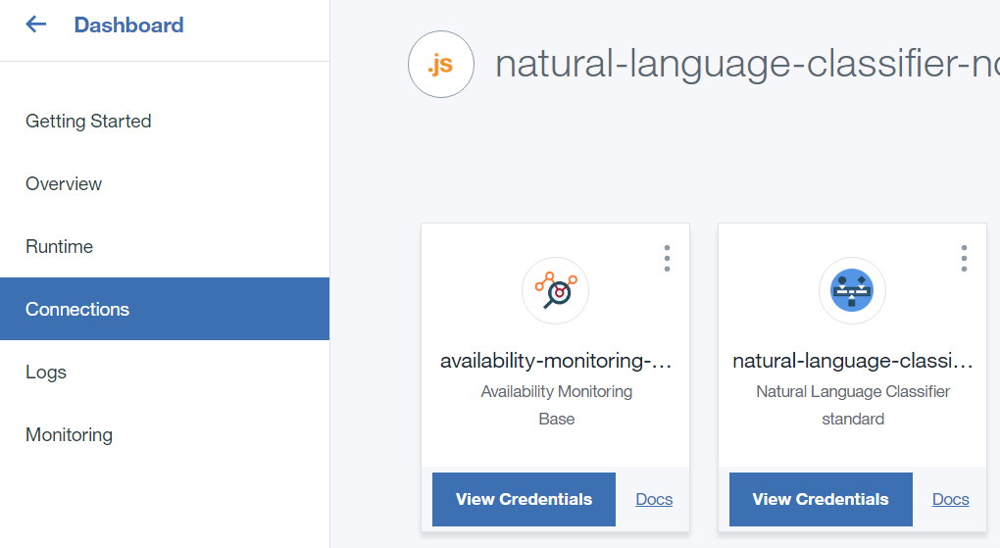

# NLC App Instructions

## Pre-requisites
* Complete the [Dev Env Setup](https://github.com/Bluemix-Watson-Labs/Dev-Env-Setup) steps.

## Lab

1. 	Fork & clone the app using the Blue “Create Toolchain” button at [this GitHub repo](https://github.com/Bluemix-Watson-Labs/natural-language-classifier-toolchain-template).

  

2. Before clicking the “Create” button on the Toolchain page, make sure you click on the *GitHub* tool and then the *Authorize* button to give Toolchains access to create/clone repositories in your GitHub account.

  

3.	Once you click the “Create” button, click on the “Pipeline” tile to watch the progress of the deployment.

  

4.	As part of the pipeline deploy script, your Natural Language Classifier service will be created, but the service credentials won’t be. Once your pipeline has deployed your application, click the back button on the page to go back to your toolchain.

  

5.	Once you’re back on the toolchain overview page, click the “Connections” tab to see the Application that was deployed by the Pipeline tool in your toolchain. Click the App card to get taken to the Application Overview page on Bluemix.

  

6.	Once on the Application Overview page on Bluemix, you’ll see a “Connections” tab on the left there too. Click that tab to see all the Connections your running Application has on Bluemix.

  

7.	Once of the Connections should be to a “natural-language-classifier” service instance that was created by the pipeline for you as well. Click the card to go to the service instance page.

  

8.	Next click the “Service Credentials” tab at the top and click the “New Credential” button, then “Add”. You now have a set of credentials that your application can use.

  

9. Open your Terminal (Git Bash in Windows) and store the username/password as environment variables in your shell. Do not close the Terminal window afterwards.

 ```
NLC_USERNAME=<username you copied from credentials above>
NLC_PASSWORD=<password you copied from credentials above>
 ```

10. Download the training data by running the following in your Terminal window (same one as above)

    ```
    mkdir -p ~/tmp
    cd ~/tmp
    curl -O "https://raw.githubusercontent.com/watson-developer-cloud/doc-tutorial-downloads/master/natural-language-classifier/weather_data_train.csv"
    ```

11. The training data was actually created for line endings on older Mac versions (9 or earlier). We must convert the line endings based on the platform you're currently on.

  * If you're on Windows, run the following sed command in Git Bash to convert the line endings to the Windows ones:
    ```
    sed 's/\r/\r\n/g' weather_data_train.csv > weather_data_train_fixed.csv
    ```
  * If you're on Mac OS X (which all the Macbooks should be on) or Linux, run the following command:
    ```
    tr '\r' '\n' < weather_data_train.csv > weather_data_train_fixed.csv
    ```
  * Now feed in the weather data to your classifier to train it.
    ```
    curl -i -u "${NLC_USERNAME}":"${NLC_PASSWORD}" -F training_data=@./weather_data_train_fixed.csv -F training_metadata="{\"language\":\"en\",\"name\":\"TutorialClassifier\"}" "https://gateway.watsonplatform.net/natural-language-classifier/api/v1/classifiers"
    ```
  * The response of the above curl command should contain a `classifier_id`. Record this id and add it as an env var to your open terminal, as follows.
    ```
    NLC_CLASSIFIER_ID=<classifier_id>
    ```
  * The training takes about 6 minutes. In order to check if its done you can query using the following curl command. The `status` should be set to `Available` when the training is done. While waiting, you can complete step 12 and 13 below.
    ```
    curl -u "${NLC_USERNAME}":"${NLC_PASSWORD}" \
"https://gateway.watsonplatform.net/natural-language-classifier/api/v1/classifiers/$NLC_CLASSIFIER_ID"
    ```

12.	To configure your running natural language classifier application to use your classifier, you must set the classifier ID as an environment variable. We can do this the pipeline script.
  * Go back to your application `Connections` page by clicking on the "Back arrow" next to `Natural-Language-Classifier-Nodejs`.

 

  ```
  $ cf set-env <application-name> CLASSIFIER_ID <classifier-id>
  ```
  * Once back on the Application Connections page, go back to the Application `Overview` page, from the left sidebar.
  * Once on your Application Overview page, scroll down and to the right and you should see a section called `Continuous Delivery`, click the `View Toolchain` button in order to back to the Toolchain overview page.

  

  * Once on the Toolchain overview page, click on the Pipeline tile
  * Once on the Pipeline overview page, click the gear icon on the "Deploy" stage and then the `Configure Stage` option

  

  * Finally, scroll down to the `Deploy script` section and edit the script there to add the following two lines after the `cf push` one and then hit `Save`.

  ```
  cf set-env ${CF_APP_NAME} CLASSIFIER_ID ${NLC_CLASSIFIER_ID}
  cf restage ${CF_APP_NAME}
  ```

  * The `CF_APP_NAME` environment variable is already being set, but let's add the `NLC_CLASSIFIER_ID` as a Pipeline environment variable now. Click the Gear icon on the Deploy stage again and then click the `Environment Properties` tab to switch to it.

  * Click the `Add Property` button and select `Text Property`.

  

  * For the `Name` enter `NLC_CLASSIFIER_ID` and for the `Value` enter your Classifier's ID that you got earlier. Then hit `Save`.

  * Lastly, hit the Play button on the Deploy Stage (next to the Gear icon). To re-deploy your application with the `CLASSIFIER_ID` environment variable set.

13.	Now that you've set the `CLASSIFIER_ID`, your application running on Bluemix should be working properly. Click on the first blue link under the `Last Execution Result` in the Pipeline Deploy stage and it should launch your application running on Bluemix. Try some of the sample questions or try some of your own.

See the original lab [here](https://www.ibm.com/watson/developercloud/doc/nl-classifier/get_start.shtml) for some more ideas on what you can do.
